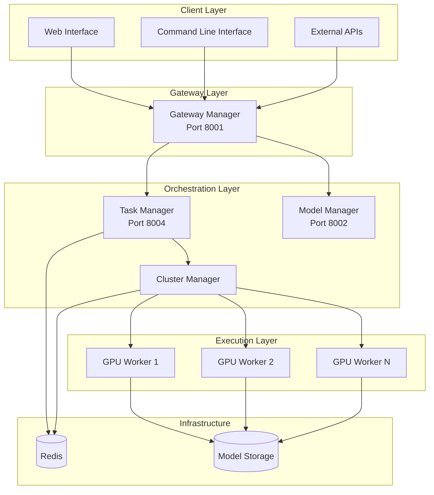

# BitingLip

<div align="center">
  
**A Production-Ready Distributed AI Inference Platform**

[](LICENSE)
[](https://python.org)
[](https://fastapi.tiangolo.com)
[](https://redis.io)

</div>

---

## Overview

BitingLip is an enterprise-grade distributed AI inference platform built with a modular microservices architecture. It provides scalable, GPU-accelerated AI model serving with comprehensive support for multiple model types including text generation, image synthesis, embeddings, and custom model deployment.

### Key Capabilities

- **Horizontal Scaling**: Dynamic GPU cluster management with automatic worker discovery
- **Multi-Modal AI**: Support for text, image, audio, and custom model types
- **Enterprise Ready**: Production-grade authentication, monitoring, and observability
- **Developer Friendly**: Comprehensive APIs, CLI tools, and web interface

## Architecture



## Quick Start

### Prerequisites

- Python 3.8+
- Redis Server
- CUDA-capable GPU (recommended)
- Docker (optional)

### Installation

```bash
# Clone the repository with all submodules
git clone --recurse-submodules https://github.com/BitingLip/biting-lip.git
cd biting-lip

# Install dependencies (if not using Docker)
pip install -r requirements.txt

# Start Redis (required for task queue)
cd managers/cluster-manager && docker-compose up -d redis && cd ../..
```

### Starting the Platform

```bash
# Method 1: Individual Services (Development)
cd managers/model-manager && python app/main.py &      # Port 8002
cd managers/task-manager && python app/main.py &      # Port 8004  
cd managers/cluster-manager/cluster/worker && python app/worker.py &
cd managers/gateway-manager && python app/main.py     # Port 8001

# Method 2: Docker Compose (Production)
docker-compose up -d
```

### Verification

```bash
# Check service health
curl http://localhost:8001/health
curl http://localhost:8002/health
curl http://localhost:8004/health

# Submit a test inference request
curl -X POST http://localhost:8001/api/v1/inference/text-generation \
  -H "Content-Type: application/json" \
  -d '{"model": "gpt2", "prompt": "Hello world", "max_tokens": 50}'
```

## Platform Components

| Component | Status | Port | Purpose | Documentation |
|-----------|--------|------|---------|---------------|
| **Gateway Manager** | 🟢 Production Ready | 8001 | API gateway, authentication, rate limiting | [📖 Docs](managers/gateway-manager/docs/) |
| **Model Manager** | 🟢 Production Ready | 8002 | Model lifecycle, storage, registry | [📖 Docs](managers/model-manager/docs/) |
| **Task Manager** | 🟢 Production Ready | 8004 | Task scheduling, queue management | [📖 Docs](managers/task-manager/docs/) |
| **Cluster Manager** | 🟢 Production Ready | 8083 | Worker orchestration, load balancing | [📖 Docs](managers/cluster-manager/docs/) |
| **Web Interface** | 🟡 In Development | 3000 | Management dashboard, monitoring | [📖 Docs](interfaces/graphical-user-interface/docs/) |
| **CLI Tools** | 🟢 Production Ready | - | Command-line utilities | [📖 Docs](interfaces/command-line-interface/docs/) |

**Status Legend:**
- 🟢 **Production Ready**: Fully tested, documented, and deployed
- 🟡 **In Development**: Core functionality complete, additional features in progress
- 🔵 **Planning**: Architecture defined, implementation pending

## Core Features

### 🚀 **High-Performance Inference**
- GPU-accelerated model execution
- Automatic model loading and caching
- Optimized memory management
- Batch processing support

### � **Intelligent Task Orchestration**
- Priority-based queue management
- Dynamic load balancing
- Fault tolerance and retry mechanisms
- Resource-aware scheduling

### 📦 **Comprehensive Model Management**
- HuggingFace Hub integration
- Custom model uploads
- Version control and rollback
- Automated model optimization

### 🌐 **Enterprise API Gateway**
- RESTful API with OpenAPI documentation
- JWT-based authentication
- Rate limiting and quota management
- Request/response validation

### � **Observability & Monitoring**
- Real-time metrics and dashboards
- Distributed tracing
- Performance analytics
- Health checks and alerting

## API Examples

### Text Generation
```bash
curl -X POST http://localhost:8001/api/v1/inference/text-generation \
  -H "Authorization: Bearer YOUR_API_KEY" \
  -H "Content-Type: application/json" \
  -d '{
    "model": "gpt2",
    "prompt": "The future of AI is",
    "max_tokens": 100,
    "temperature": 0.7
  }'
```

### Image Generation
```bash
curl -X POST http://localhost:8001/api/v1/inference/image-generation \
  -H "Authorization: Bearer YOUR_API_KEY" \
  -H "Content-Type: application/json" \
  -d '{
    "model": "stable-diffusion-xl",
    "prompt": "A beautiful landscape at sunset",
    "width": 1024,
    "height": 1024,
    "steps": 50
  }'
```

### Model Management
```bash
# List available models
curl -H "Authorization: Bearer YOUR_API_KEY" \
     http://localhost:8001/api/v1/models

# Download a new model
curl -X POST http://localhost:8001/api/v1/models/download \
  -H "Authorization: Bearer YOUR_API_KEY" \
  -H "Content-Type: application/json" \
  -d '{
    "model_name": "llama-2-7b",
    "source": "huggingface"
  }'
```

## Documentation

### 📋 **Platform Documentation**
- [🏗️ **Architecture Overview**](docs/architecture.md) - System design and component interaction
- [🚀 **Deployment Guide**](docs/deployment.md) - Production deployment and scaling strategies
- [� **Development Guide**](docs/development.md) - Setup, workflow, and contribution guidelines

### 🔍 **Component Documentation**
- [**Gateway Manager**](managers/gateway-manager/docs/) - API gateway configuration and usage
- [**Model Manager**](managers/model-manager/docs/) - Model lifecycle and storage management
- [**Task Manager**](managers/task-manager/docs/) - Task scheduling and execution
- [**Cluster Manager**](managers/cluster-manager/docs/) - Worker node management and scaling

## Technology Stack

### **Backend Services**
- **Framework**: FastAPI (Python 3.8+)
- **Task Queue**: Celery + Redis
- **Authentication**: JWT with configurable providers
- **Monitoring**: Prometheus + Grafana
- **Storage**: File system + configurable object storage

### **Frontend & Interfaces**
- **Web UI**: Vue.js 3 + TypeScript + Vite
- **CLI**: Python Click/Typer
- **API**: OpenAPI 3.0 compliant

### **Infrastructure**
- **Containerization**: Docker + Docker Compose
- **Orchestration**: Kubernetes support (planned)
- **GPU Support**: CUDA, ROCm
- **Caching**: Redis

## Development Workflow

### Contributing to Submodules

1. **Navigate to the target submodule**:
   ```bash
   cd managers/gateway-manager
   ```

2. **Make your changes and commit**:
   ```bash
   git add .
   git commit -m "feat: add new feature"
   git push origin main
   ```

3. **Update the parent repository**:
   ```bash
   cd ../../
   git add managers/gateway-manager
   git commit -m "chore: update gateway-manager to latest version"
   git push origin main
   ```

### Local Development

```bash
# Install development dependencies
pip install -r requirements-dev.txt

# Run tests
python -m pytest tests/

# Start development servers with hot reload
python -m app.main --reload
```

## Deployment

### Production Deployment

```bash
# Using Docker Compose
docker-compose -f docker-compose.prod.yml up -d

# Using Kubernetes (coming soon)
kubectl apply -f k8s/
```

### Environment Configuration

```bash
# Copy environment template
cp config/environments/production.env.template config/environments/production.env

# Edit configuration
nano config/environments/production.env
```

## Support & Community

- **Documentation**: [docs.bitinglip.com](https://docs.bitinglip.com) *(planned)*
- **Issues**: [GitHub Issues](https://github.com/BitingLip/biting-lip/issues)
- **Discussions**: [GitHub Discussions](https://github.com/BitingLip/biting-lip/discussions)

## License

This project is licensed under the MIT License - see the [LICENSE](LICENSE) file for details.

---

## Repository Structure

This is a monorepo containing the following submodules:

- [**cluster-manager**](https://github.com/BitingLip/cluster-manager) - GPU cluster and worker management
- [**gateway-manager**](https://github.com/BitingLip/gateway-manager) - API gateway and request routing
- [**model-manager**](https://github.com/BitingLip/model-manager) - Model storage and lifecycle management
- [**task-manager**](https://github.com/BitingLip/task-manager) - Task scheduling and execution
- [**user-interface**](https://github.com/BitingLip/user-interface) - Web UI and CLI tools

<div align="center">
  
**Built with ❤️ for the AI community**

</div>
