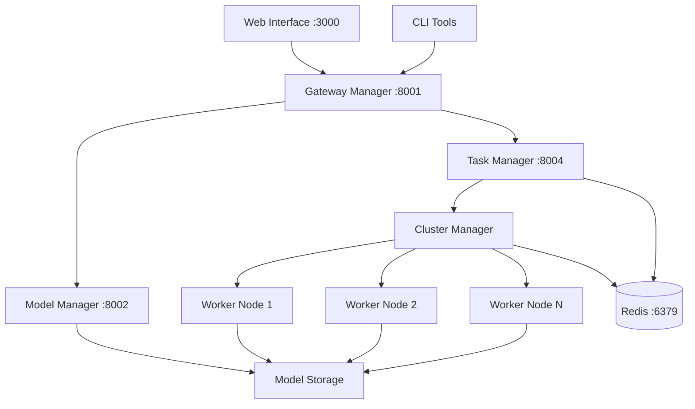

# BitingLip Architecture Overview

## System Architecture

BitingLip is a distributed AI inference platform built with a microservices architecture. Each module is designed to be independently deployable and scalable.

## Core Components

### Request Flow
1. **Client Request** → Gateway Manager (API validation, authentication)
2. **Task Creation** → Task Manager (scheduling, queuing)
3. **Work Distribution** → Cluster Manager (worker assignment)
4. **Model Loading** → Model Manager (centralized model access)
5. **Task Execution** → Worker Nodes (GPU-accelerated inference)
6. **Result Return** → Client (through Gateway Manager)

### Data Flow
- **Models**: Centralized storage in `model-manager/models/`
- **Tasks**: Redis-based queuing with Celery
- **Results**: Temporary storage with configurable persistence
- **Metrics**: Real-time monitoring across all components

## Technology Stack

- **API Framework**: FastAPI (Python)
- **Task Queue**: Celery + Redis
- **Model Loading**: HuggingFace Transformers
- **GPU Acceleration**: CUDA, PyTorch
- **Frontend**: Vue.js + Vite (planned)
- **CLI**: Click/Typer (planned)
- **Containerization**: Docker (infrastructure ready)

## Deployment Modes

### Development
- Individual module startup
- Local Redis instance
- Single worker node

### Production
- Docker Compose orchestration
- Multi-worker GPU cluster
- Load balancing and monitoring

## Security Considerations

- API key authentication
- Rate limiting per client
- Model access controls
- Resource usage monitoring
